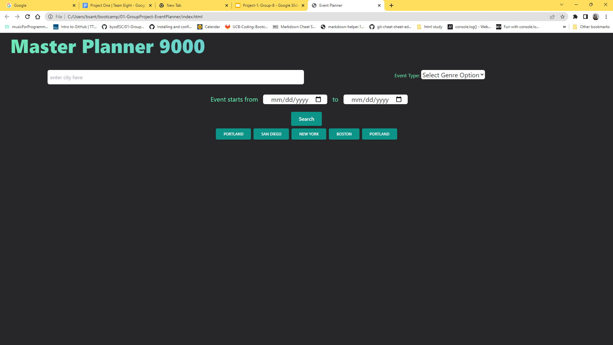

# Master Planner

## technologies Used

| Technology Used         | Resource URL           | 
| ------------- |:-------------:| 
| Javascript    | [https://developer.mozilla.org/en-US/docs/Web/JavaScript](https://developer.mozilla.org/en-US/docs/Web/JavaScript) | 
| HTML    | [https://developer.mozilla.org/en-US/docs/Web/HTML](https://developer.mozilla.org/en-US/docs/Web/HTML) |   
| Git | [https://www.w3schools.com/git/default.asp](https://www.w3schools.com/git/default.asp)     |  
| D3.js | [https://d3js.org/](https://d3js.org/)     |  
| TailwindCSS | [https://tailwindcss.com/](https://tailwindcss.com/)     |  
| weatherAPI | [https://www.weatherapi.com/](https://www.weatherapi.com/)     |  
| TicketmasterAPI | [https://developer.ticketmaster.com/products-and-docs/apis/getting-started/](https://developer.ticketmaster.com/products-and-docs/apis/getting-started/)     |  

## Description

[Visit the deployed site here](https://byxzesc.github.io/01-GroupProject-EventPlanner/)

Search any major city for a Ticketmaster event, such as Sporting events, Music concerts and more. You can filter your search by genre and date range. On the event cards you will see the name of the event, the date of the event, a price range for tickets and a more "More Info" button. You can click on the event card to widen it and display the predicted weather for that event, up to 300 days in the future. Once you have found an event you can click on the "More Info" button to take you to the ticketmaster website to find seating and ticket availabilites.

 

## Usage

You can search for a range of events filtered by genre or search all events by leaving the genre empty. You can also set a date range from the date picker but the weather feature only predicts up to 300 days. The "More Info button is linked the Ticketmaster site to show you seating and available tickets. We display a price range from the cheapest ticket to the most expensive ticket.
## Weather Display

## Showcasing Local Storage

## Showcasing Weather function

## Showcasing More Info button

## Learning Points

During this project we gained experience calling on a server side API and dynamically displaying the parsed information to the page. The building of this app also called to dig into technical documentation to understand how to utilize the API and other new technologies such as TailwindCSS and D3.js. The overall experience helped us get a better understanding how to work as a team and how to overcome obsticles in an efficient manner.

## Arthor Info

The groups github links:

[Alex Horning](https://github.com/makeitouthill/)

[Brian Zhao](https://github.com/byxzESC)

[Brett Santor](https://github.com/BrettSantor)

[Jonathan Pohahau](https://github.com/j-pohahau5)

## Badges

## Credit

All this coding made possible by [Jerome Chenette](https://github.com/jeromechenette) and our fellow students who help each other along the way
